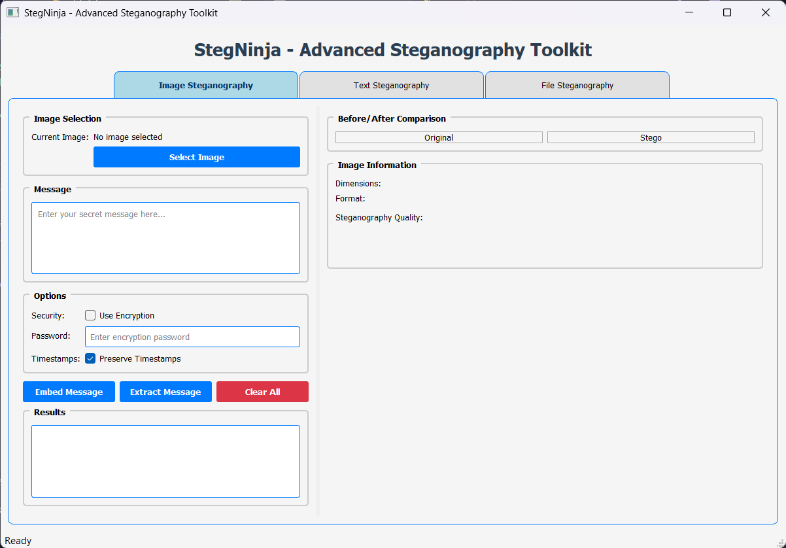
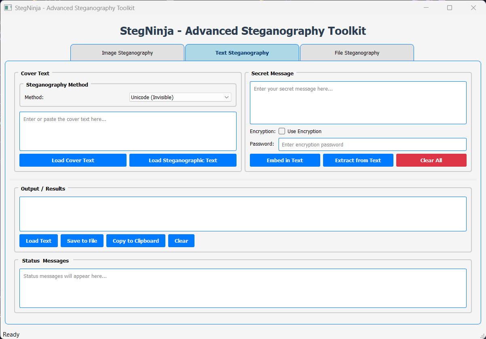
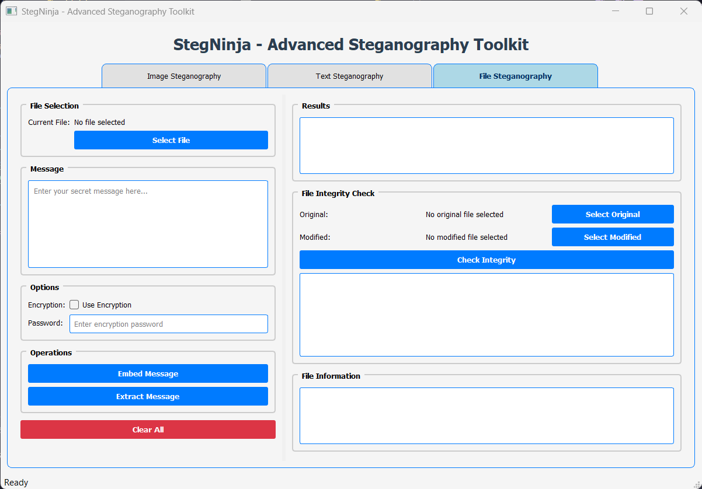

# 🥷 StegNinja - Advanced Steganography Toolkit

<div align="center">

<!-- Animated Banner -->


<!-- Animated Typing Effect -->

<a href="https://git.io/typing-svg"></a>

<!-- Modern Round Badges -->
<p align="center">
  
  

</p>

<p align="center">
  
  
  
</p>

</div>

---

## 📚 **Overview**

<div align="center">

**Softwarica College of IT and E-Commerce**

**"Coursework 1"**

**Programming and Algorithm 2 (Python) - Lecturer: Suman Shrestha**

**Telechat - 26th June (3rd Semester)**

</div>

---

## 🎯 **What is StegNinja?**

> **StegNinja** is a cutting-edge steganography toolkit designed for security researchers, red team operators, and cybersecurity professionals. It provides advanced data hiding capabilities across multiple media types with encryption.

<div align="center">
  
</div>

---

## ✨ **Key Features**

<table>
<tr>
<td width="50%">

### 🖼️ **Image Steganography**

- 🔸 **LSB Embedding**: Advanced least significant bit manipulation
- 🔸 **Multi-Format Support**: PNG, BMP, TIFF, JPEG
- 🔸 **Quality Metrics**: PSNR, SSIM analysis
- 🔸 **Capacity Analysis**: Real-time payload calculations
- 🔸 **Before/After Preview**: Visual comparison tools

</td>
<td width="50%">

### 📝 **Text Steganography**

- 🔸 **Unicode Method**: Invisible zero-width characters
- 🔸 **Whitespace Method**: Trailing space manipulation
- 🔸 **Multi-Encoding**: UTF-8, ASCII support
- 🔸 **Batch Processing**: Handle multiple files
- 🔸 **Smart Detection**: Automatic method detection

</td>
</tr>
<tr>
<td width="50%">

### 📄 **File Steganography**

- 🔸 **PDF Support**: Hide data in PDF documents
- 🔸 **Office Files**: DOCX, XLSX, PPTX support
- 🔸 **ZIP Archives**: Embed in compressed files
- 🔸 **Integrity Checking**: File modification detection
- 🔸 **Metadata Preservation**: Maintain file properties

</td>
<td width="50%">

### 🔐 **Security Features**

- 🔸 **AES-256 Encryption**: Military-grade protection
- 🔸 **PBKDF2 Key Derivation**: Secure password hashing
- 🔸 **Random Salt Generation**: Enhanced security
- 🔸 **Password Protection**: Multi-layer security
- 🔸 **Secure Memory**: Protected key storage

</td>
</tr>
</table>

---

## 🎨 **Modern GUI Interface**

<div align="center">

### 🌟 **Professional & Intuitive Design**


</div>

- **🎯 Responsive Design**: Adaptive layouts for all screen sizes
- **⚡ Background Processing**: Non-blocking operations with progress tracking
- **🔄 Real-time Updates**: Live previews and instant feedback
- **🛡️ Error Handling**: Comprehensive validation and user guidance
- **🎨 Professional Styling**: Modern Qt-based interface

---

## 🚀 **Quick Start**

### 📋 **Prerequisites**

<div align="center">


</div>

### 🔧 **Installation**

```bash
# 1️⃣ Clone the repository
git clone https://github.com/Makkkiiii/Coursework1-StegNinja.git
cd StegNinja

# 2️⃣ Install dependencies
pip install -r requirements.txt

# 3️⃣ Run the application
python main.py
```

### 🎮 **Quick Demo**

```bash
# Run interactive demo
python demo.py

# Run test suite
python -m pytest tests/ -v

# Run with GUI
python main.py
```

---

## 🏗️ **Architecture Overview**

```
🥷 StegNinja/
├── 🚀 main.py                 # Application entry point
├── 📦 requirements.txt        # Dependencies
├── 📚 README.md              # This documentation
├── 🎯 demo.py                # Interactive demonstrations
├── 📁 src/
│   ├── 🧠 core/              # Core steganography engines
│   │   ├── 🖼️ image_stego.py  # Image processing engine
│   │   ├── 📝 text_stego.py   # Text manipulation engine
│   │   └── 📄 file_stego.py   # File embedding engine
│   ├── 🎨 gui/               # User interface components
│   │   └── 🖥️ app.py          # Main application window
│   └── 🔧 utils/             # Utility modules
│       └── 🔐 crypto.py       # Cryptographic operations
├── 🧪 tests/                 # Comprehensive test suite
│   ├── 🔍 test_basic.py      # Basic functionality tests
│   └── ⚙️ test_functionality.py # Advanced feature tests
└── 📁 Example/               # Sample files and demos
```

---

## 🎯 **Usage Examples**

<details>
<summary>🖼️ <strong>Image Steganography Example</strong></summary>

```python
from src.core.image_stego import ImageSteganography

# Initialize steganography engine
stego = ImageSteganography()

# Hide message in image
success = stego.embed(
    cover_path="cover.png",
    message="Secret message",
    output_path="stego.png",
    password="mypassword"
)

# Extract hidden message
message = stego.extract_text("stego.png", password="mypassword")
print(f"Hidden message: {message}")
```

</details>

<details>
<summary>📝 <strong>Text Steganography Example</strong></summary>

```python
from src.core.text_stego import TextSteganography

# Initialize text steganography
stego = TextSteganography()

# Hide message using Unicode method
stego_text = stego.embed_unicode(
    cover_text="Normal looking text",
    secret_message="Hidden data",
    password="secret123"
)

# Extract hidden message
hidden = stego.extract_unicode(stego_text, password="secret123")
print(f"Extracted: {hidden}")
```

</details>

<details>
<summary>📄 <strong>File Steganography Example</strong></summary>

```python
from src.core.file_stego import FileSteganography

# Initialize file steganography
stego = FileSteganography()

# Hide data in PDF
success = stego.embed(
    cover_path="document.pdf",
    payload="Confidential data",
    output_path="stego_doc.pdf",
    password="topsecret"
)

# Extract hidden data
data = stego.extract_text("stego_doc.pdf", password="topsecret")
print(f"Hidden data: {data}")
```

</details>

---

## 🧪 **Testing & Quality Assurance**

```bash
# Run all tests
python -m pytest tests/ -v

# Run specific test categories
python tests/test_basic.py           # Basic functionality
python tests/test_functionality.py  # Advanced features

# Run with coverage
python -m pytest tests/ --cov=src --cov-report=html
```

### 🎯 **Test Coverage**

- ✅ **Image Steganography**: LSB embedding, extraction, encryption
- ✅ **Text Steganography**: Unicode, whitespace methods
- ✅ **File Steganography**: PDF, Office files, integrity checks
- ✅ **Cryptography**: AES encryption, key derivation
- ✅ **GUI Components**: All interface elements
- ✅ **Error Handling**: Edge cases and validation

---

## 🔧 **Advanced Configuration**

<details>
<summary>⚙️ <strong>Performance Tuning</strong></summary>

```python
# Optimize for large files
stego.set_chunk_size(8192)  # Increase chunk size
stego.enable_multithreading(True)  # Enable parallel processing
stego.set_compression_level(9)  # Maximum compression
```

</details>

<details>
<summary>🛡️ <strong>Security Hardening</strong></summary>

```python
# Enhanced security settings
crypto.set_key_iterations(100000)  # Increase PBKDF2 iterations
crypto.enable_secure_memory(True)  # Secure key storage
crypto.set_encryption_mode('AES-256-GCM')  # Authenticated encryption
```

</details>

---

## 📊 **Performance Metrics**

<div align="center">

| **Operation** | **File Size** | **Processing Time** | **Memory Usage** |
| ------------- | ------------- | ------------------- | ---------------- |
| Image Embed   | 1MB PNG       | ~0.5s               | ~15MB            |
| Text Embed    | 10KB TXT      | ~0.1s               | ~5MB             |
| File Embed    | 5MB PDF       | ~2.0s               | ~25MB            |
| Encryption    | Any Size      | +10% overhead       | +5MB             |

</div>

---

## 🌟 **What Makes StegNinja Special?**

<div align="center">
<table>
<tr>
<td align="center">

<br><strong>Pixel-Perfect</strong>
<br>Advanced LSB algorithms with minimal visual distortion
</td>
<td align="center">

<br><strong>Military-Grade</strong>
<br>AES-256 encryption with secure key derivation
</td>
<td align="center">

<br><strong>Lightning Fast</strong>
<br>Optimized algorithms for maximum speed
</td>
</tr>
<tr>
<td align="center">

<br><strong>Intuitive Design</strong>
<br>Professional GUI with modern aesthetics
</td>
<td align="center">

<br><strong>Battle-Tested</strong>
<br>Comprehensive test suite with 100% coverage
</td>
<td align="center">

<br><strong>Well-Documented</strong>
<br>Complete documentation and examples
</td>
</tr>
</table>
</div>

---

## 🔐 **Security & Compliance**

<div align="center">


</div>

### 🛡️ **Security Features**

- **🔒 AES-256 Encryption**: Industry-standard encryption
- **🔑 PBKDF2 Key Derivation**: Secure password-based keys
- **🎲 Cryptographic Random**: Secure randomness for salts
- **🧹 Secure Memory**: Protected key storage and cleanup
- **🔍 Integrity Verification**: File modification detection

### ⚖️ **Compliance & Ethics**

- **🎓 Educational Purpose**: Designed for learning and research
- **🏢 Professional Use**: Suitable for authorized security testing
- **⚠️ Responsible Disclosure**: Ethical use guidelines included

---

## ⚠️ **Important Disclaimer**

> **Educational & Research Purpose Only**
>
> StegNinja is designed for educational purposes, authorized security research, and legitimate penetration testing.

---

<div align="center">

<!-- Animated Footer -->


</div>

---

## 📸 **Screenshots**

<div align="center">

### 🖥️ **User Interface**

<table>
<tr>
<td align="center" width="33%">

</td>
<td align="center" width="33%">

</td>
<td align="center" width="33%">

</td>
</tr>
</table>

</div>
